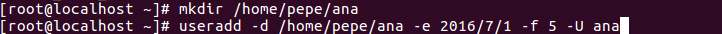
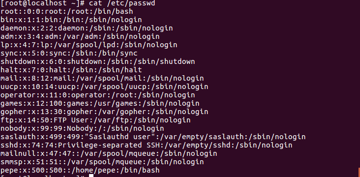
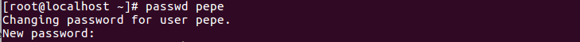
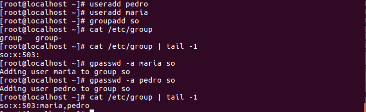
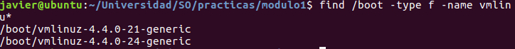

#Módulo I Administración de Linux. Sesión 1.Herramientas de administración básicas.

###Creación de script
 
 Creamos un script que inicialice el sistema necesario para prácticas.

!()[imgs/script.png]

###Gestión de usuarios
Los archivos que contienen información acerca de los usuarios son:
1. /etc/passwd (info de las cuentas de usuario)
2. /etc/shadow (passwords encriptados + envejecimiento de cuentas)
3. /etc/group (Grupos y usuarios pertenecientes)

####Creación cuentas usuario
Linux proporciona los comandos *useradd* o *adduser* para crear cuentas usuario, gestionando archivos como /etc/passwd, /etc/shadow y /etc/group, además de un directorio para el usuario y los archivos de configuración de cuenta.
Si no indica una configuración para el usuario, este los toma por defecto de los archivos, */etc/default/useradd y /etc/login.defs

A continuación creamos una cuenta para el usuario *pepe* y vemos los archivos /etc/passwd y /etc/group

En este punto faltaría una contraseña para el usuario pepe que se consigue con el comando passwd.

Algunas características que se pueden gestionar a la hora de usar el comando *useradd* son:
.. -d, --home-dir HOME_DIR | HOME_DIR será el directorio de login del usuario(HOME_DIR debe de existir)
.. -e, --expiredate EXPIRE_DATE | Introducimos la fecha cuando se debe de deshabilitar(YYYY-MM-DD)
.. -f, --inactive INACTIVE | num de días que sigue siendo válido el password del usuario después de que la cuenta es permanentemente deshabilitada. 
.. -g, --gid GROUP |  el nombre del grupo del usuario(debe de existir) o el gid que se asigna como grupo principal.
.. -G, --groups GROUP1,... | lista de grupos adicionales de los que es miembro el usuario.
.. -k, --skel SKEL_DIR | directorio que contiene los datos a copiar en el HOME del usuario
.. -u, --uid UID | el valor numérico del identificador de usuario
.. -U, --usergroup | crea un grupo con el nombre del usuario

Cuando se quiere crear un usuario con los valores por defecto pero necesitamos alguna pequeña modificación podemos usar la orden

Si en algún momento queremos eliminar un usuario debemos de usar la orden *userdel*. En este caso si la usamos sin parámetros nos dejará su carpeta personal. Esta orden por si sola elimina el usuario de los archivos de gestión de usuario( passwd,shadow y group). En caso de querer eliminarlo del sistema junto con su carpeta y archivos contenidos.

Para ver la información del usuario podemos verla directamente en el archivo /etc/passwd

donde el formato es *nombre cuenta:contraseña:UID:GID:nombre usuario:directorio del usuario:shell que usa*

Como se puede ver cualquier usuario puede acceder a dicho archivo ya que aunque el propietario sea *root* tiene derecho de lectura para *otros*.

####Cambio de contraseña

Para establecer una contraseña el usuario *root* puede hacerlo sobre cualquier otro, mientras que un usuario cualquiera solo puede la propia.

Las contraseñas se almacenan en el sistema operativo en forma de hash(resumen) dentro del archivo */etc/passwd*. Para protegerlo de que lo pueda leer cualquier usuario se le quitan los privilegios.

###Parámetros de configuración de una cuenta

Los parámetros relativos a la contraseña como son última vez que se cambió la contraseña, tiempo que hace falta para poder cambiarla,... se guardan también en el archivo */etc/passwd*.

Para cambiarlos tenemos las órdenes chage y passwd.
chage \[argumentos\] usuario
.. -d ult_día usuario | Fecha del último cambio de password
.. -m min_dias usuario | nº de días que deben de pasar para poder cambiar el pass
.. -M max_dias usuario | nº de días máximo que puede estar el usuario sin cambiar la contraseña
.. -W warn_dias usuario | recordatorio tantos días antes de que cambie la contraseña el usuario
.. -I inac_días usuario | cuantos días después de que la contraseña expire seguirá siendo válida la cuenta si no se cambia la pass.
 .. .E exp_dias usuario | fecha en la que la cuenta se deshabilita de forma automática

###Gestión de grupos

Los grupos son asociaciones de usuarios que comparten archivos y recursos. Para poder gestionarlos tenemos las siguientes órdenes:
* groupadd grupo | crea un nuevo grupo
* groupmod grupo | modifica un grupo
* groupdel grupo | elimina un grupo
* **newgrp grupo** | cambia el grupo activo
* gpasswd grupo | asigna una contraseña al grupo
* **gpasswd -a user grupo**|añade un usuario al grupo
* groups \[usuario\] | indica los grupos a los que pertenece el usuario
* gprchk | comprueba la consistencia de /etc/group

A continuación se muestra como creamos 1 grupo y después le asociamos dos usuarios

Si nos fijamos en los grupos a los que pertenece el superusuario root vemos que no solo forma parte de su propio grupo si no además del grupo sys,daemon,... dichos grupos los crea el sistema el sistema UNIX.

###Organización del sistema de archivos

El encargado de arrancar nuestro sistema y que contiene el kernel es el archivo, es vmlinu\[x|z\]*. Para encontrarlo usamos la función *find* y nos devuelve:

Dentro del sistema de archivos existe una carpeta en la raiz que es */tmp*. En ella se almacenan datos temporales que se borran una vez se apaga el sistema, pero hay casos en los que queremos que las aplicaciones de tipo *root* mantengan la información temporal y para ello tenemos la carpeta */var/tmp*.

####Acceso a la información del SA
Para conocer los sistemas de archivos que se montan al inicio en nuestro sistema miramos el archivo */etc/fstab/* (*/etc/mtab/* muestra los montados en este momento y es la salida de la orden *mount*)

* El primer campo que aparece es el SA a montar puede ser un dispositivo especial de bloque o un SA remoto 
* El segundo indica el punto de montaje del SA
* El tercero el tipo de SA que es
* El cuarto es la opciones de montado como rw,nouser, nomount,...
* El quinto es para saber es cuando hacer una copia
* El sexto es para saber si al SA se le debe de chequear la integridad

Dentro del SA existe un SA virtual /proc que mantiene la información en tiempo de ejecución del sistema, es decir, es el que controla como va funcionando el sistema. Por tanto, si se busca información del estado *actual* se debe de buscar en esta dirección. Aquí podemos encontrar los archivos */proc/filesystems* que dice los SA que permite montar el SO y */proc/mounts* que nos dice los SA montados en este momento.

