##Sesión 2. Herramientas de administración del SA.

####Partición de dispositivos de almacenamiento secundario

#####Partición de un dispositivo
1. Debe de existir un archivo especial de dispositivo que sirva de interfaz del dispositivo para el SO, por ejemplo /dev/sda.
2. La partición es un dispositivo seguido de un número p.ej. /dev/sda**2**

#####Creación de un dispositivo simulado y de su tabla de partición

Ahora vamos a crear un dispositivo simulado donde posteriormente se harán las particiones. Para ello seguimos los siguientes pasos:

1. Creamos los archivos especiales de dispositivos **/dev/loop0** y **/dev/loop1** mediante la orden **mknod**

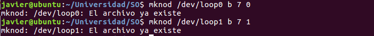

El argumento *b* es para indicar que va a ser un dispositivo de bloque mientras que los números son (major,minor) indicadores del driver que se asocia con el archivo así como el identificador para que el *kernel* sepa exactamente que dispositivo es.

2. Creamos archivos que contendrán la información de las particiones

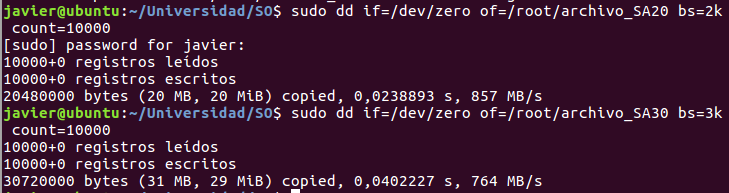

El archivo se crea a partir del dispositivo */dev/zero* que devuelve ceros o caracteres *null* hasta llegar al tamaño deseado que en este caso es 20MB y 30MB. 

3. Finalmente asociamos el dispositivo con el archivo

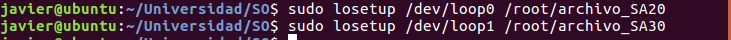

A partir de este momento tenemos creados dos dispositivos de tipo bloque

4. Creamos la tabla de particiones con la orden

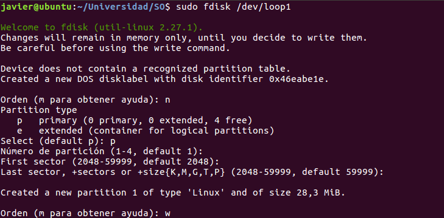

Simplemente se dice que va a ser una partición primaria y se eligen los valores por defecto ya que va a ocupar todo el espacio del dispositivo.

#####Asignación de un SA a una partición.

Para ello utilizamos la orden *mke2fs* que hace un formateo lógico de la partición creando el SA.

1. Creamos SA de tipo *ext3* y *ext4* en las particiones */dev/loop0* y */dev/loop1* creadas en el paso anterior.

Ahora vemos que hemos usado los parámetros -L y -t para asignar la etiqueta y el tipo de SA que queremos en la partición.

**Orden mke2fs**

Forma simplificada con solo unos pocos argumentos posibles

	+ mke2fs \[argumentos\] dispositivo tamaño

tamaño | tamaño del SA.P.ej. Para poder fraccionar la partición y usar varios SA.
-L *nombre* | agregarle una etiqueta al SA
-m *% tamaño* | reservar un porcentaje del SA para que sea solo del *superusuario* 
-M *ultimo directorio montado* | 
-t *tipo* | elegir entre ext2,ext3 o ext4

2. Modificar o ajustar los parámetros de nuestro SA (ext2,ext3 o ext4). Para ello usamos la orden **tune2fs**.
	+ tune2fs \[argumentos\] dispositivo

*argumentos*:

-l | muestra el contenido del superbloque del SA
-c *max-mount-counts* | establece el máximo número de veces que se monta el SA antes de ser chequeado. Si es 0 o -1 fscheck no lo chequeará.
-C *mount-count* | establecer el número de veces que ha sido montado el sistema
-m *porcentaje_bloques_reservados* | porcentaje del tamaño del SA que será usado por 
-r *numero_bloques_reservados* | establece el número de bloques reservados del SA.
-u *usuario* | fija el usuario que puede usar los bloques reservados, mediante uid o nombre.
-g *grupo* | asigna el grupo, por medio del gid o el nombre, que podrá usar la zona reservada del SA
-L *etiqueta* | asigna la etiqueta al SA.

**forzar el chequeo de un SA para comprobar la integridad**

Cuando arranca el sistema y se montan los sistemas Linux chequea los sistemas a los que le toque. Para forzarlo hacemos 

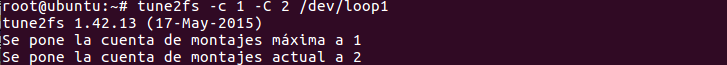

donde hemos cambiado la bloque del SA poniendo que el número máximo de montajes sin chequear sea 1, a la vez que hemos puesto el SA como si se hubiera montado un número mayor de veces, 2 en este caso. 

**reservar bloques del SA a un usuario**

Con tune2fs hemos visto que se puede reservar un número de bloques para uso exclusivo. Si le indicamos el usuario podemos hacer que el pueda hacer uso de los bloques reservados.

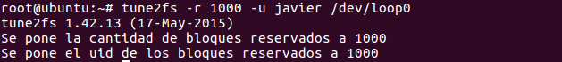

 
#####Montaje de un SA

Una vez tenemos nuestro SA solo necesitamos que forme parte del árbol de directorios y así poder empezar a contener archivos y directorios. Para ello necesitamos montar nuestro SA en un directorio del árbol.

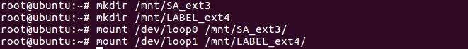

Además de indicar el punto de montaje se pueden incluir diferentes opciones acerca de los atributos del SA mediante la opcion **-o**. Entre ellos están

+ rw | solo escritura
+ ro | solo lectura
+ suid/nosuid | permitir o no el *sticky bit*
+ auto/noauto | montar automáticamente
+ exec/noexec | permitir o no la ejecución de ficheros
+ usrquota, grpquota | activar las cuotas de usuario, grupo.
+ defaults= rw,suid,dev,exec,auto,nouser,async
+ user, users, owner | Permitir a los usuarios montar el SA 
+ uid=*numero*, gid=*numero* | Propietario y grupo propietario
+ umask | máscara a aplicar a los permisos de los archivos

#####Automontaje al arranque

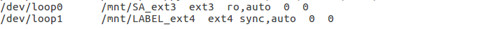

añadiendo la opción auto a la línea tratará de montarse al arranque del sistema.

#####Administración de cuotas

Una característica interesante de los SA es que se pueden asignar cuotas, permitiendo limitar el uso de los bloques. El primer paso es tener instalado el paquete cuotas.

1. Ahora toca modificar el bloque del SA y permitir quotas. Modificamos el archivo *fstab* para montarlo con cuotas para usuarios.

2. 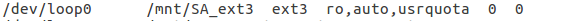

3. Lo volvemos a montar 

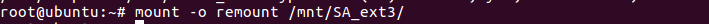

4. Creamos el archivo que permite la gestión de cuotas.

5. Activamos el *servicio* de cuotas

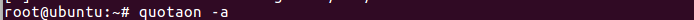

6. En este momento que ya funciona el servicio establecemos las cuotas de los usuarios.

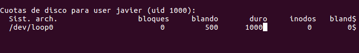

7. Una vez establecida vemos como se van gestionando

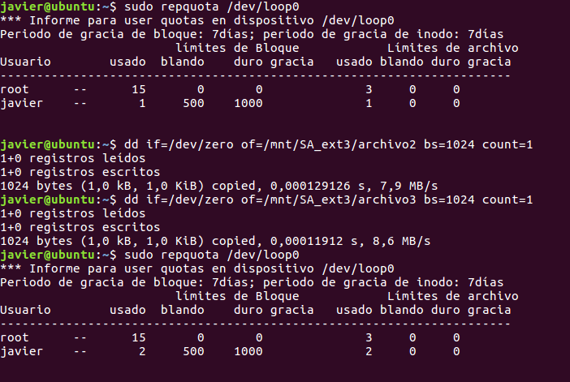

Se puede observar como se va llevando un control de las cuotas.

