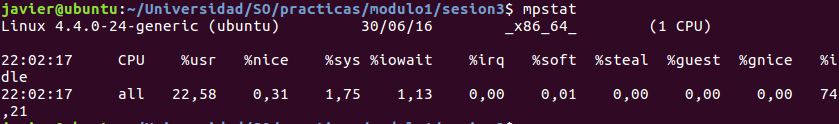
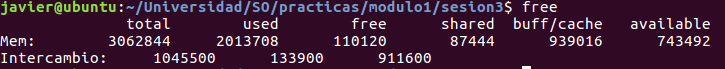
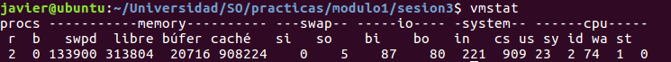
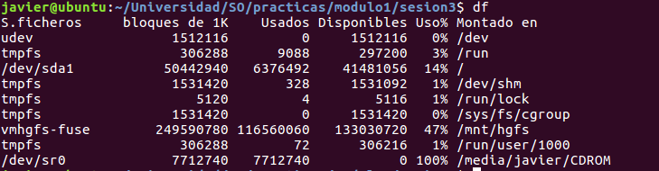
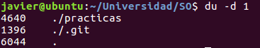
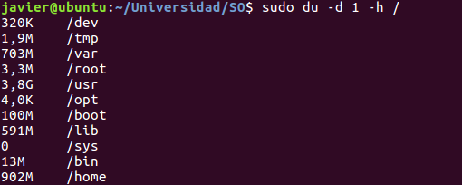
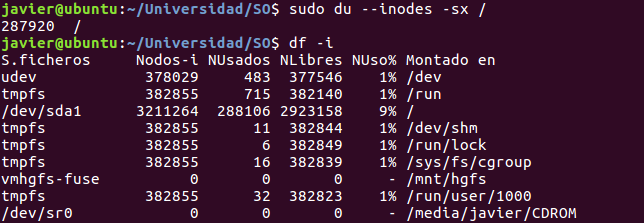
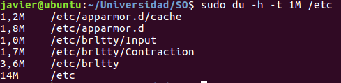
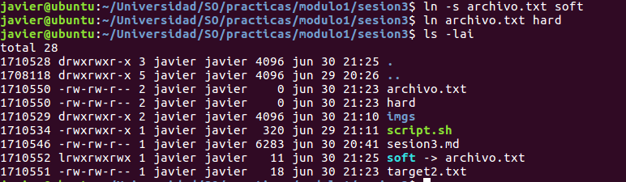
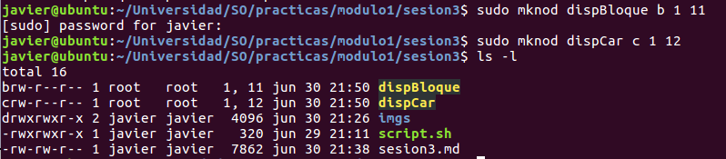

#Módulo 1. Sesión 3. Monitorización del sistema

##1. Control y gestión de CPU


###a)Orden *uptime*

Para conocer el tiempo que lleva el SO en ejecución, el número de usuarios, y la carga en los últimos 1,5 y 15 minutos.


Ahí se puede ver que hay **2 usuarios conectados**, lleva funcionando **3 horas 15 minutos**, y la **carga** es **0.04,0.06 y 0.06** siendo la de los últimos 15 minutos 0.06.

###b)Orden time

Indica la cantidad de tiempo que ha necesitado un programa para finalizar. Mostrando tiempo total(real), tiempo de ejecución en modo usuario(user) y tiempo de ejecución en modo kernel(sys). La suma de las ejecuciones es menor o igual que el real debido al *tiempo en espera*.


###c)Orden nice y renice

Orden nice. Permite asignar una prioridad a un archivo que queremos ejecutar. Los valores de \[0,19\] son los que pueden usar los usuarios, mientras que si es \[-19,-1\](negativos) sólo puede asignarlos el usuario *root*. Por defecto es 10.

Podemos ver las prioridades de los programas con la utilidad *ps*. La opción -o sirve para indicar la información de los procesos que deseamos monitorizar.

Un ejemplo de cómo se puede adelantar la ejecución de un programa frente a otro que había entrado en el sistema antes se muestra en la siguiente imagen


Para verlo de forma experimental, calculamos los tiempos con la orden time de cada procedimiento. Podiendo ver que el segundo lanzado adelanta al primero, y el tercero debe de esperar a la finalización de los otros dos.


###d)Orden pstree

Utilidad para ver el árbol de procesos en ejecución en un instante dado.

###e)Orden ps

Sirve para mostrar los procesos que se están ejecujando en un instante. Uno de las formas mas usadas es 

```bash
$ps aux

Muestra todos los procesos que se están ejecutando en un instante con sintaxis BSD

a: lista los procesos de todos que se están ejecutando en una terminal
x: muestra los procesos que no tienen asignada una tty, incluidos los que tienen pts.
ax: muestra todos los procesos en un terminal(combinación de ambos parámetros)
u: formato de salida usuario. Es decir, USER,pid,...

$ps -ef

Muestra todos los procesos corriendo con una sintaxis estándar.

$ps T

Muestra todos los procesos corrindo en este terminal

$ps r

Muestra todos los procesos corriendo

$ps -C comando

Muestra la información del comando. En caso de que no exista, devuelve una lista vacía.

$ps aux --sort=-pcpu,-pmem

```


###f)Orden top

Utilidad que muestra en tiempo real la metainformación de los procesos en ejecución. Además de indicar en la primera sección información como la que devuelve *uptime*, El número de tareas, la utilización de la CPU,memoria usada y libre, memoria de swap libre y usada. También enseña la memoria física que está libre pero la usa el núcleo como buffer/caché para agilizar los procesos( última columna de la primera línea), y la cantidad de memoria que se puede usar antes de hacer swapping(última columna segunda fila, avail Mem).

La parte de abajo muestra lo mismo que la orden ps.


Otra característica interesante es que se puede interactuar. Para ello podemos usar las teclas

* r : cambiar la prioridad de algún proceso
* k : terminar un proceso
* N : ordenación según PID
* P : ordenación según uso de CPU
* n : elegir el número de procesos a mostrar
* q : salir 


###g)Orden mpstat


Cuando queremos conocer el estado del procesador podemos usar la orden mpstat.



* CPU (Número del procesador)
* %usr (% de uso de cpu en modo usuario)
* %nice (% de uso de cpu por parte de procesos con prioridad > 0 y nivel usuario)
* %sys (% de uso de cpu en modo kernel)
* %iowait (% de tiempo que la CPU se encuentra en estado ocioso a causa de excepcionales E/S)
* %irq (% tiempo usado en interrupciones hardware)
* %soft (% de tiempo usado en interrupciones software)
* %idle (% porcentaje de tiempo en estado ocioso sin grande E/S)


##2. Control y gestión de memoria.

###a)Orden free

Muestra la información de memoria como lo hace top pero siendo un proceso ligero.




Lo que cabe resaltar es cómo se calcula el valor de memoria usada, y es sumando la que están usando los programas más la que usa el núcleo como búffer y caché.

###b)Orden vmstat

Además de mostrar información de memoria, muestra información de procesos, E/S y cpu. La forma de usarse puede ser por intervalos de tiempo, indicando cada cuanto tiempo toma una muestra y cuantas muestras se desean. 



En este caso hemos pedido que se tome una muestra cada 5 segundos y que tome 3.

La información que aporta es:

*Procesos*

* r (procesos esperando por el procesador o haciendo uso de él).
* b (procesos en estado estado ininterruptible, es decir, que sólo saldrá del bloqueo cuando se haya producido el evento por el que espera)

*Memoria*

* swpd (memoria virtual usada)
* libre (memoria sin usar)
* búfer (memoria usada por el núcleo como búfer)
* caché (memoria usada por el núcleo como caché)

*Swap*

* si (cantidad de memoria llevada a disco)
* so (cantidad de memoria traida de disco)

*IO*

* bi (bloques recibidos por un archivo de bloque)
* bo (bloques enviados a un archivo de bloques)

*Sistema*

* in (número de interrupciones por segundo)
* cs (número de cambios de contexto por segundo)

*CPU*

* us  (% tiempo usado en modo usuario)
* sy  (% tiempo de cpu usado en modo núcleo)
* id  (% tiempo de cpu estando ocioso)


##3.Control y gestión de dispositivos de E/S

###a)Información de archivo

La orden que muestra los archivos que aparecen en un directorio es *ls*. Indicando que queremos el formato largo, opción -l, además podemos ver el tipo de archivo, permisos,... Si lo que queremos es ver el tiempo de acceso usamos la opción -lu y si queremos el tiempo de última modificación de sus metadatos, usamos -lc

###b)Consulta de metadatos del SA

**Orden df**

Permite ver para todos los SA montados, el almacenamiento total, usado y libre; y el punto de montaje del SA



Está información se muestra usando bloques como unidad, mientras que si queremos usar inodos podemos usar *df -i*

**Orden du**

Si queremos ver el espacio que usa un directorio, por defecto en bloques usados, llenos o no.



En este caso hemos puesto *-d 1* para indicar que queremos saber sólo un resumen de lo que se encuentra dentro de la carpeta. Para saber sólo los bloque que usa la carpeta usamos *-d 0* o *-s*

Otras posibilidades es en cuanto el formato, que pueden ser inodos. Si lo que queremos es mostrar con formato más amigable usamos la opción *-h*



Otra opción interesante es *-x* que solo contabiliza en un SA, en caso de que se hayan montado más SA, no se tienen en cuenta. Por ejemplo, 



Si lo que queremos es ver los archivos de un tamaño determinado, usamos *-t*(threshold)



Finalmente, para mostrar con este comando la información de los archivos también, no solo directorios, podemos usar la opción *-a*.


###c)Creación de enlaces de archivo

Los enlaces sirven para referenciar a nombres de archivo, enlaces blandos, y a los metadatos, enlaces duros. El enlace duro se asigna al inodo de un archivo cuando se crea.

En el caso de necesitar crear enlaces podemos usar la orden **ln**.



El número de enlaces duros de un archivo se puede ver como un número situado delante del usuario creador, y como puede verse el archivo *archivo.txt* tiene 2 enlaces duros ya que *duro* es también un enlace duro al mismo archivo. Por otra parte creamos un enlace blando llamado *soft*, que es sólo una referencia al archivo. 

###d)Archivos especiales de dispositivo

Para crear archivos de tipo bloque o caracteres usamos la orden mknod. Estos archivos son la interfaz de dispositivos.



Para reconocer los archivos especiales debemos de mirar el primer caracter de la entrada de la orden *ls -l*. Si aparece una b es de tipo bloque y si aparece una c es de tipo caracter.


 
