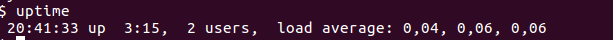
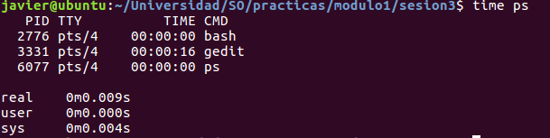
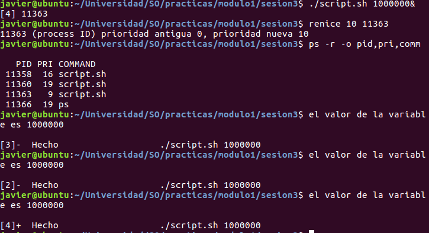
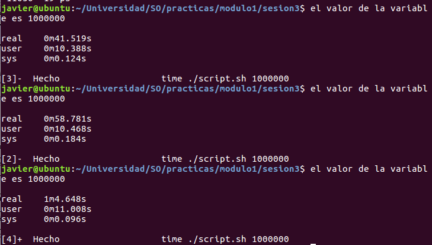
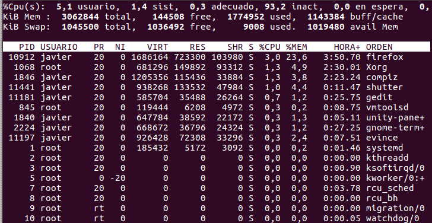

#Módulo 1. Sesión 3. Monitorización del sistema

##1. Control y gestión de CPU


###a)Orden *uptime*

Para conocer el tiempo que lleva el SO en ejecución, el número de usuarios, y la carga en los últimos 1,5 y 15 minutos.



Ahí se puede ver que hay **2 usuarios conectados**, lleva funcionando **3 horas 15 minutos**, y la **carga** es **0.04,0.06 y 0.06** siendo la de los últimos 15 minutos 0.06.

###b)Orden time

Indica la cantidad de tiempo que ha necesitado un programa para finalizar. Mostrando tiempo total(real), tiempo de ejecución en modo usuario(user) y tiempo de ejecución en modo kernel(sys). La suma de las ejecuciones es menor o igual que el real debido al *tiempo en espera*.



###c)Orden nice y renice

Orden nice. Permite asignar una prioridad a un archivo que queremos ejecutar. Los valores de \[0,19\] son los que pueden usar los usuarios, mientras que si es \[-19,-1\](negativos) sólo puede asignarlos el usuario *root*. Por defecto es 10.

Podemos ver las prioridades de los programas con la utilidad *ps*. La opción -o sirve para indicar la información de los procesos que deseamos monitorizar.

Un ejemplo de cómo se puede adelantar la ejecución de un programa frente a otro que había entrado en el sistema antes se muestra en la siguiente imagen



Para verlo de forma experimental, calculamos los tiempos con la orden time de cada procedimiento. Podiendo ver que el segundo lanzado adelanta al primero, y el tercero debe de esperar a la finalización de los otros dos.




###d)Orden pstree

Utilidad para ver el árbol de procesos en ejecución en un instante dado.

###e)Orden ps

Sirve para mostrar los procesos que se están ejecujando en un instante. Uno de las formas mas usadas es 

```bash
$ps aux

Muestra todos los procesos que se están ejecutando en un instante con sintaxis BSD

a: lista los procesos de todos que se están ejecutando en una terminal
x: muestra los procesos que no tienen asignada una tty, incluidos los que tienen pts.
ax: muestra todos los procesos en un terminal(combinación de ambos parámetros)
u: formato de salida usuario. Es decir, USER,pid,...

$ps -ef

Muestra todos los procesos corriendo con una sintaxis estándar.

$ps T

Muestra todos los procesos corrindo en este terminal

$ps r

Muestra todos los procesos corriendo

$ps -C comando

Muestra la información del comando. En caso de que no exista, devuelve una lista vacía.

$ps aux --sort=-pcpu,-pmem

```


###f)Orden top

Utilidad que muestra en tiempo real la metainformación de los procesos en ejecución. Además de indicar en la primera sección información como la que devuelve *uptime*, El número de tareas, la utilización de la CPU,memoria usada y libre, memoria de swap libre y usada. También enseña la memoria física que está libre pero la usa el núcleo como buffer/caché para agilizar los procesos( última columna de la primera línea), y la cantidad de memoria que se puede usar antes de hacer swapping(última columna segunda fila, avail Mem).

La parte de abajo muestra lo mismo que la orden ps.




Otra característica interesante es que se puede interactuar. Para ello podemos usar las teclas

* r : cambiar la prioridad de algún proceso
* k : terminar un proceso
* N : ordenación según PID
* P : ordenación según uso de CPU
* n : elegir el número de procesos a mostrar


###g)Orden mpstat
* q : salir 


