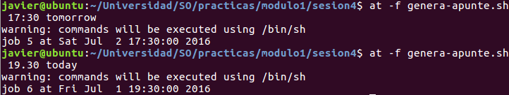
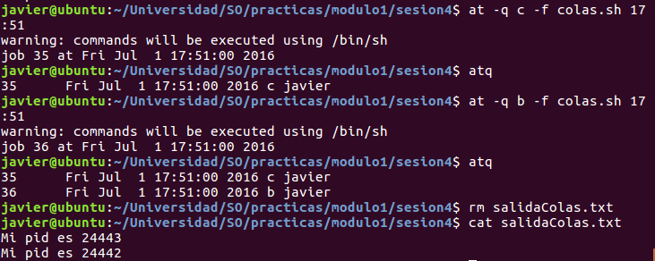

#Módulo1, Sesión4. Automatización de tareas.

##Ejecución de tareas a una determinada hora.

Para programar la ejecución de tareas en un determinado momento usamos el demonio(*daemon*) **atd**. Dicho demonio permite las órdenes en línea de comando:

* **at** ( petición de ejecución de órdenes en un determinado momento)
* **atq** ( consultar las peticiones)
* **atrm** ( quitar alguna petición)
* **batch** ( petición de ejecución cuando la carga del sistema sea baja)

Además de poder ejecutar tareas en un momento determinado, se pueden programar para que se ejecuten de forma periódica. Para ello contamos con el demonio *crond*(que se explicará más adelante). Lo que hay que entender de la naturaleza de los *demonios* es quién es su padre, cuál es la terminal asociada, y quién lo crea. Para ello podemos usar la orden ps.


Dicha orden nos dice que el padre es el proceso *init*(PID=1), que no tienen terminal asociada y finalmente los usuarios que lo ejecutan son *root* y *daemon*.

##Orden at.

Ejemplo básico para generar la ejecución de un script en un momento determinado


```bash
$at \[-f script\] TIME

Sirve para establecer a la hora TIME la ejecución del script. Si no se aporta un script la entrada será por entrada estándar.

Formas de expresar TIME:

* midnight;noon ( a medianoche o media mañana)
* now,midnight,noon + X \[minutes\hours\days\weeks\]


* HH:MM Mon DD ( ejecuta a la hora y días indicados, siendo Mon las tres primeras letras en inglés del mes y DD el día en números)
* HH:MM today,tomorrow



* MMDDYY o Mon DD \[YY\]YY ( en este momento en la fecha indicada)


En el caso de elegir una fecha pasada especificando hora y mes día año, nos indica que no es posible.


```

###Entorno de ejecución de órdenes con at 

Algo a tener en cuenta a la hora de programar el momento de ejecutar la tarea son las variables de entorno que tendrá. La tarea retiene :

* el directorio desde donde se hizo la petición como la ruta a usar.
* las variables de entorno que hay definidas en el momento de hacer la petición.
* la máscara umask.

Para ver quien es el encargado de ejecutar el script en el futuro hacemos lo siguiente


Donde vemos que es *atd* el proceso padre. 

###Salida estándar y salida error estándar

Para ejecutar un script tenemos que tener el permiso de ejecución activo además de indicar por medio de .\/script, en caso de que no aparezca la ruta donde se hizo la petición en la variable $PATH.

Por ejemplo podemos ejecutar un script como *find.sh* y encontrar todos los archivos modificados en las últimas 24 horas dentro del directorio *$HOME*.


En caso de haber un error decimos que se redirija al archivo error.log

###Orden batch

En caso de que queramos realizar un trabajo cuando el sistema no esté muy cargado y pueda atender la petición con holgura, usamos la orden *batch*

```bash
$>batch
```

###Uso de colas con el comando at
El demonio atd maneja colas de prioridad para ordenar las peticiones y están comprendidas de a-z. La más prioritaria es la *a* que además es la que usa por defecto at y están ordenadas en orden decreciente, siendo z la que tendría menos prioridad. Por ejemplo, para probar esta característica podemos lanzar 3 veces un script a la misma hora estando en distintas colas las peticiones. 



###Usuario permitidos para ejecutar el demonio atd

Para controlar el uso del demonio se pueden usar dos archivos /etc/at.allow /etc/at.deny(si no existen, se pueden crear). En caso de no existir, se siguen las normas establecidas en el SO.

##Ejecuciones periódicas con el demonio cron

El demonio cron ejecuta órdenes de manera periódica, y para indicar las órdenes usamos el comando **cron**. La forma es pasarle un fichero a cron con un determinado formato.

Formato:

minuto hora díaMes mes diaSemana orden

por ejemplo

\* 12 * * * * ls>salida.txt

ejecuta el comando todos los días a las 12.00h.

Por ejemplo, si queremos lanzar un programa cada minuto


el problema viene en saber las variables que usará, y en este caso no es como con *at* y debemos de indicar la ruta de origen del ejecutable a lanzar, la salida del ejecutable,etc

Un ejemplo, de este ejecutable es el script *cronFile* donde le hemos pasado la ruta completa a todas las órdenes y también en cada ejecutable usado.


##Especificando variables de entorno

Algunas variables de entorno se pueden modificar, por ejemplo $PATH, pero crontab no hace la sustitución de una variable que va después de la asignación, es decir, VARIABLE = $V2. En este caso, VARIABLE  no contiene lo que tiene V2. Pero para ello podemos hacer un script, que haga un archivo de tipo crontab, que le hemos llamado *generador.sh*. Hay que fijarse que en PATH debe de aparece la ruta completa del directorio de trabajo y tampoco podemos usar *~* Por ejemplo, tenemos el siguiente script generado, que permite no tener que indicar la ruta de ejecución.


##Gestionando permisos de uso crontab

Para ello creamos el archivo cron.deny y añadimos usuarios que aperezcan en /etc/passwd. Por ejemplo, añado a *javier*


